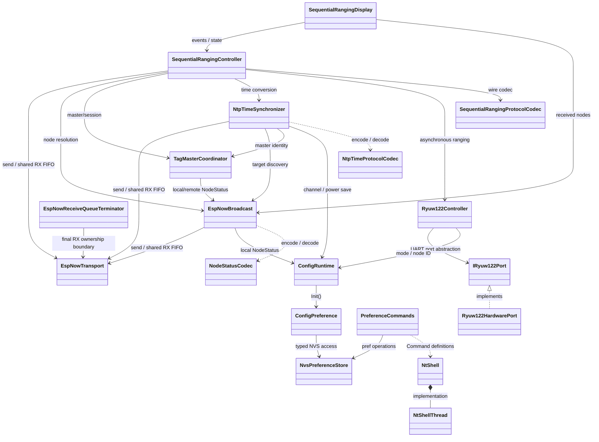
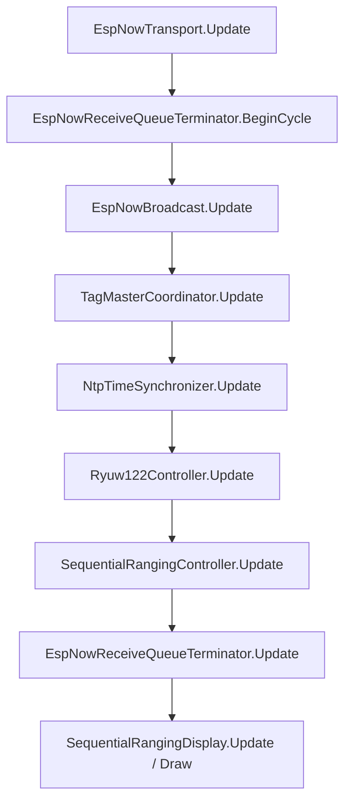
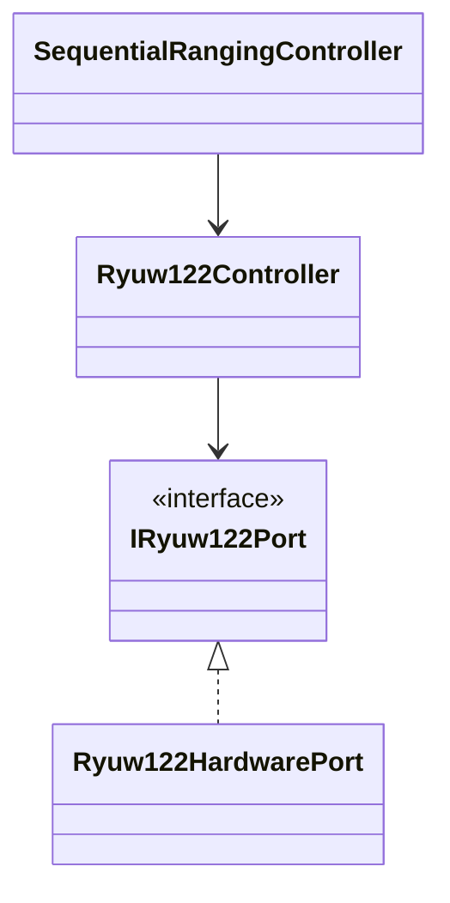

# 現在のクラス責務とクラス間関係

## 1. 目的

本書は、現在の`master`実装を基準として、RYUW122_M5StickS3を構成するクラスの役割、依存方向、実行時の連携順序を整理する。

複数TAG順次測距と時刻同期のプロトコル詳細は[複数TAG順次測距・マスターTAG基準時刻同期設計](./sequential-ranging-time-sync.md)を参照する。本書はその実装構成を補足し、現在のクラス境界を記録する。

対象は`include/`および`src/`にあるプロジェクト側クラスと、`main.cpp`におけるcompositionである。`NodeStatus`や測距結果などのstruct、enum class、外部ライブラリ自体はクラス一覧の対象外とする。

## 2. 全体構成

`main.cpp`がcomposition rootであり、長寿命オブジェクトを生成して参照を注入する。主要な依存方向は次のとおりである。



図の矢印は、矢印元が矢印先を利用する依存を表す。`NtShellThread`と`Ryuw122HardwarePort`は公開ヘッダーから直接生成するクラスではなく、実装内部のクラスである。

## 3. クラス別責務

| クラス | 役割 | 主な依存先 | 現在の主な利用元 |
| --- | --- | --- | --- |
| `NvsPreferenceStore` | 値用名前空間と型メタデータ用名前空間を使い、型付きNVS値を保存・取得・列挙する。公開操作は再帰ミューテックスで排他する | ESP-IDF NVS | `ConfigPreference`, `PreferenceCommands` |
| `ConfigPreference` | アプリケーション固有のNVSキー、既定値、型付きget/setを提供する | `NvsPreferenceStore` | `ConfigRuntime`, `main.cpp` |
| `ConfigRuntime` | 起動時にNVSから読み出した設定と、実行中に変更する現在値をメモリ上で保持する | `ConfigPreference`は`Init()`時のみ | `EspNowBroadcast`, `NtpTimeSynchronizer`, `Ryuw122Controller`, `main.cpp` |
| `PreferenceCommands` | `pref`コマンド群を生成し、NT-Shellから型付きNVSを操作する | `NvsPreferenceStore`, `NtShell::Command` | `main.cpp`から`NtShell`へ登録 |
| `NtShell` | 外部定義されたコマンドを登録し、NT-Shell処理を専用スレッドで開始する公開窓口 | `NtShell::NtShellThread` | `main.cpp` |
| `NtShell::NtShellThread` | NT-Shellのブロッキング実行、Stream入出力、コマンド検索・dispatchを専用`std::thread`上で処理する | NT-Shellライブラリ, `Stream` | `NtShell`が所有 |
| `NodeStatusCodec` | `NodeStatus`と29バイト固定wire形式を相互変換し、magic/version/typeなどを検証する | なし | `EspNowBroadcast` |
| `EspNowTransport` | Wi-Fi/ESP-NOW初期化、peer管理、固定長送受信queue、1件in-flightの送信進行、受信メタデータの固定長コピーを担当する | ESP-IDF Wi-Fi/ESP-NOW/FreeRTOS queue | `EspNowBroadcast`, `NtpTimeSynchronizer`, `SequentialRangingController`, `EspNowReceiveQueueTerminator` |
| `EspNowBroadcast` | 自ノードの`NodeStatus`を定期送信し、受信した`NodeStatus`をMACアドレス別のノード表と最終受信時刻へ保存する | `EspNowTransport`, `ConfigRuntime`, `NodeStatusCodec` | `TagMasterCoordinator`, `NtpTimeSynchronizer`, `SequentialRangingController`, `SequentialRangingDisplay` |
| `EspNowReceiveQueueTerminator` | 既知consumer処理後の共有ESP-NOW受信FIFOに最終所有境界を設け、誰も消費しなかった先頭packetを1 cycle最大1件破棄する | `EspNowTransport` | `main.cpp` |
| `TagMasterCoordinator` | 有効なTAGの最小ノードIDをマスターとして選出し、自ノードのmaster/follower判定、session ID、マスター変更通知を管理する | `EspNowBroadcast` | `NtpTimeSynchronizer`, `SequentialRangingController` |
| `NtpTimeProtocolCodec` | NTP同期要求、応答、commitの固定wire形式をencode/decodeし、headerを検証する | なし | `NtpTimeSynchronizer` |
| `NtpTimeSynchronizer` | マスターTAGと非マスターノード間のNTP四時刻同期、3サンプルからの最小RTT選択、同期結果通知、32bitローカル時刻から64bitマスター時刻への変換を担当する | `EspNowTransport`, `EspNowBroadcast`, `TagMasterCoordinator`, `ConfigRuntime`, `NtpTimeProtocolCodec` | `SequentialRangingController` |
| `IRyuw122Port` | RYUW122初期化、設定、非同期測距開始、受信更新、応答取得を差し替え可能にするport interface | なし | `Ryuw122Controller` |
| `Ryuw122HardwarePort` | `HardwareSerial`とRYUW122ライブラリを`IRyuw122Port`へ接続し、UART行解析と固定長応答FIFOを実装する | `HardwareSerial`, RYUW122ライブラリ | `Ryuw122Controller`が実機用constructorで所有 |
| `Ryuw122Controller` | RYUW122のモード、network ID、address初期化と、ANCHORからTAGへの非同期測距、300ms timeout、遅延応答排出を管理する | `ConfigRuntime`, `IRyuw122Port` | `SequentialRangingController`, `main.cpp` |
| `SequentialRangingProtocolCodec` | `RangeControl`、測距結果、forward結果、round completeの固定wire形式をencode/decode・検証する | なし | `SequentialRangingController` |
| `SequentialRangingController` | master/follower/ANCHORの役割別状態機械、ANCHOR×TAGの二重ループ、逐次結果公開、round管理、時刻変換、優先度別送信FIFOを統括する | `EspNowTransport`, `EspNowBroadcast`, `TagMasterCoordinator`, `NtpTimeSynchronizer`, `Ryuw122Controller`, `SequentialRangingProtocolCodec` | `SequentialRangingDisplay`, `main.cpp` |
| `SequentialRangingDisplay` | controllerの最新測距結果・round summary・状態と、broadcastの受信ノード一覧を表示状態へ取り込み、`M5Canvas`へ描画する | `SequentialRangingController`, `EspNowBroadcast`, `M5Canvas` | `main.cpp` |

## 4. 設定系の関係

設定は永続値と実行時値を分離する。

```text
NvsPreferenceStore
  ├─ ConfigPreference ──Init()──> ConfigRuntime ──> 通信・同期・RYUW122
  └─ PreferenceCommands ──Command一覧──> NtShell
```

`ConfigPreference`はNVS上のアプリケーション固有キーを型付きで扱う。`ConfigRuntime::Init()`は起動時にその値を読み込み、通信処理は以後`ConfigRuntime`を参照する。

`PreferenceCommands`は同じ`NvsPreferenceStore`へ書き込むが、`ConfigRuntime`へ自動反映する機構は持たない。現在の`pref`設定変更は次回起動時の`ConfigRuntime::Init()`で反映される。

`main.cpp`のBtnA処理によるTAG/ANCHOR切替は`ConfigRuntime::SetRunMode()`だけを呼び、NVSへ保存しない。

## 5. ESP-NOW共有transportと受信所有境界

ESP-NOW callbackを登録して無線を所有するクラスは`EspNowTransport`だけである。上位クラスごとの受信callbackは登録しない。

`EspNowTransport`は受信packetを共通FIFOへ固定長コピーする。`EspNowBroadcast`、`NtpTimeSynchronizer`、`SequentialRangingController`はFIFO先頭を`PeekReceive()`で確認し、自分が扱うpacket種別の場合だけ`ConsumeReceive()`で削除する。自分のpacket種別でない場合は先頭を残して後続consumerへ処理機会を渡す。

現在の`loop()`での関係は次の順序である。



共有受信FIFOを直接扱う既知consumerは次の3クラスである。

1. `EspNowBroadcast`: `NodeStatus` packetを処理する。
2. `NtpTimeSynchronizer`: NTP同期packetを処理する。
3. `SequentialRangingController`: 逐次測距packetを処理する。

`EspNowReceiveQueueTerminator::BeginCycle()`は`EspNowTransport::Update()`直後の消費件数とFIFO状態を記録する。既知consumerのいずれかがそのcycleでFIFOを進めた場合、terminal側は追加破棄を行わない。誰も進めなかった場合だけ、cycle開始時から存在した未所有packetを最大1件破棄する。cycle開始後にcallbackで到着したpacketは次cycleまでterminal処理しない。

この境界により、未知packetがFIFO先頭を永久に塞ぐことを防ぎながら、後段consumer向けpacketを前段consumerが破棄しない構成になっている。

## 6. ノード検出、マスター選出、時刻同期の関係

`EspNowBroadcast`は自ノード状態と受信ノード表の所有者であり、その上に`TagMasterCoordinator`と`NtpTimeSynchronizer`が構成される。

```text
EspNowTransport
      |
      v
EspNowBroadcast ----> NodeStatus表・最終受信時刻
      |
      v
TagMasterCoordinator ----> master node ID / MAC / session ID
      |
      +----------------------+
      |                      |
      v                      v
NtpTimeSynchronizer   SequentialRangingController
```

`TagMasterCoordinator`は`EspNowBroadcast`のlocal/remote `NodeStatus`を評価してマスターを決定する。自ノードがマスターになった場合は`EspNowBroadcast::SetMasterState()`を通して自ノードのmaster宣言とsession IDを更新する。

`NtpTimeSynchronizer`は`TagMasterCoordinator`のmaster identityを基準に同期状態を管理し、`EspNowBroadcast`の有効ノード表から同期対象を見つける。通信は共有`EspNowTransport`、wire変換は`NtpTimeProtocolCodec`を使用する。

`SequentialRangingController`は同じmaster identityとノード表を利用し、`NtpTimeSynchronizer`の同期完了判定と時刻変換結果を使って測距roundを進める。このためマスター選出、時刻同期、逐次測距の順に論理的な依存が形成される。

## 7. RYUW122抽象化の関係

`Ryuw122Controller`は逐次測距状態機械からUART詳細を分離する境界である。



実機用constructorでは`Ryuw122Controller`が`Ryuw122HardwarePort`を生成・所有する。差し替え用constructorでは外部から`IRyuw122Port`を注入し、controllerはそのportを所有しない。

`Ryuw122HardwarePort`は`src/Ryuw122Controller.cpp`内の実装詳細で、G7 TX、G1 RX、115200bpsのUART、受信行解析、固定長応答FIFOを扱う。`Ryuw122Controller`はその上で初期化条件、測距中状態、timeout、遅延応答排出、公開する`Ryuw122RangingResult`を管理する。

`SequentialRangingController`はUARTやAT応答を直接扱わず、`StartRanging()`、`Update()`、`TryTakeResult()`を通じて非同期測距だけを利用する。

## 8. 逐次測距と表示の関係

`SequentialRangingController`は通信、ノード情報、マスター情報、時刻同期、UWB測距を集約するアプリケーション中核の状態機械である。

主な入力は次のとおりである。

- `EspNowTransport`: 逐次測距packetの送受信
- `EspNowBroadcast`: round snapshotに使用するノード情報とMAC/UWB address解決
- `TagMasterCoordinator`: 現在のmaster/sessionと変更検出
- `NtpTimeSynchronizer`: 同期完了判定とANCHORローカル時刻のmaster時刻変換
- `Ryuw122Controller`: ANCHORでの非同期UWB測距
- `SequentialRangingProtocolCodec`: 逐次測距wire packetの変換と検証

主な出力は、固定長FIFOから`TryTakeMeasurement()`で取得する`TimedRangeMeasurement`と、`TryTakeCompletedRound()`で取得する`SequentialRangeRoundSummary`である。

現在のUIでは`SequentialRangingDisplay`がこれらを取り出して最新表示状態として保持する。さらに`EspNowBroadcast::GetNodes()`から受信ノード一覧を取得する。表示側は無線送信、マスター選出、時刻変換、UWB測距を実行しない。

`SequentialRangingController::GetResetGeneration()`が変化した場合、`SequentialRangingDisplay`は旧sessionの保持済みmeasurement/summaryを破棄する。

## 9. NT-Shellの関係

`PreferenceCommands`が生成した`std::vector<NtShell::Command>`を`main.cpp`が`NtShell::RegisterCommands()`へ渡す。したがって`NtShell`は`PreferenceCommands`そのものへ依存せず、外部登録されたコマンド定義だけを知る。

`NtShell::Start()`は内部の`NtShellThread`を`std::thread`で開始し、NT-Shellのブロッキング`ntshell_execute()`をそのスレッド内へ閉じ込める。メイン`loop()`はNT-Shellの入力待ちではブロックされない。

現在は`PreferenceCommands`のNVS操作が`NvsPreferenceStore`を直接使用する。`NvsPreferenceStore`の公開操作はミューテックスで排他されるため、NT-ShellスレッドからのNVSアクセスと他のNVS利用を同じstoreに集約できる。

## 10. `main.cpp`の生成順と開始順

現在のグローバルオブジェクト生成順は次のとおりである。参照先が先に構築される順序になっている。

```text
NtShell
NvsPreferenceStore
PreferenceCommands
ConfigPreference
ConfigRuntime
EspNowTransport
EspNowBroadcast
TagMasterCoordinator
NtpTimeSynchronizer
Ryuw122Controller
M5Canvas
SequentialRangingProtocolCodec
SequentialRangingController
EspNowReceiveQueueTerminator
SequentialRangingDisplay
```

`setup()`の主要な開始順は次のとおりである。

```text
NvsPreferenceStore.Begin
ConfigRuntime.Init
Ryuw122Controller.Begin
EspNowTransport.Begin
EspNowBroadcast.Begin
TagMasterCoordinator.Begin
SequentialRangingController.Begin
SequentialRangingDisplay initialization/update/draw
NtShell.RegisterCommands
NtShell.Start
```

`SequentialRangingController::Begin()`はESP-NOW transport/broadcastの開始に成功し、かつ`Ryuw122Controller::Begin()`が成功した場合だけ呼び出す。`TagMasterCoordinator::Begin()`はESP-NOW開始成功時に呼び出す。

## 11. クラス境界の要約

- 永続設定は`NvsPreferenceStore`と`ConfigPreference`、実行時設定は`ConfigRuntime`へ分離する。
- ESP-NOW callbackとqueue所有は`EspNowTransport`へ集約し、上位consumerは共有FIFOをpacket種別ごとに協調して消費する。
- ノード表は`EspNowBroadcast`、master/sessionは`TagMasterCoordinator`、時計差は`NtpTimeSynchronizer`がそれぞれ所有する。
- RYUW122のUART詳細は`IRyuw122Port`境界の内側へ閉じ込め、逐次測距は`Ryuw122Controller`の非同期APIだけを使用する。
- 測距round全体の状態機械は`SequentialRangingController`へ集約し、表示は`SequentialRangingDisplay`へ分離する。
- wire形式変換は`NodeStatusCodec`、`NtpTimeProtocolCodec`、`SequentialRangingProtocolCodec`へ分離する。
- NT-Shellのブロッキング実行は専用スレッドへ分離し、コマンド実装は`PreferenceCommands`から外部登録する。
