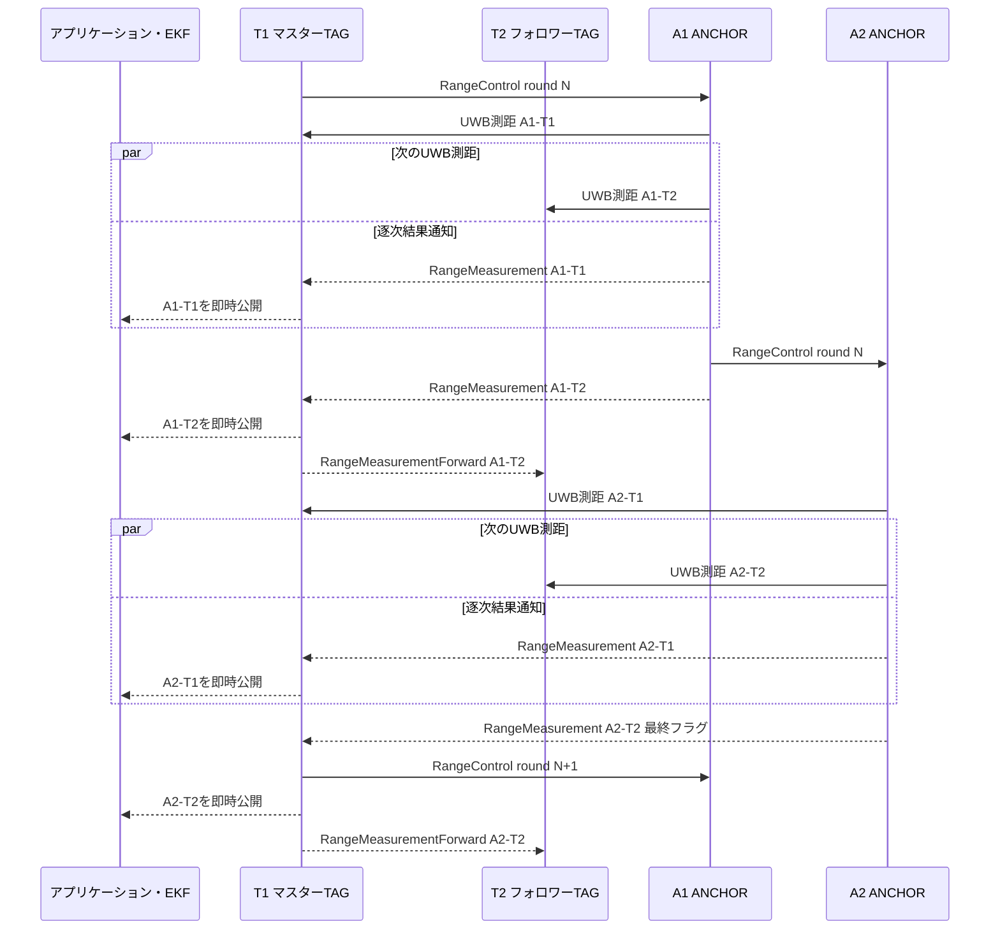
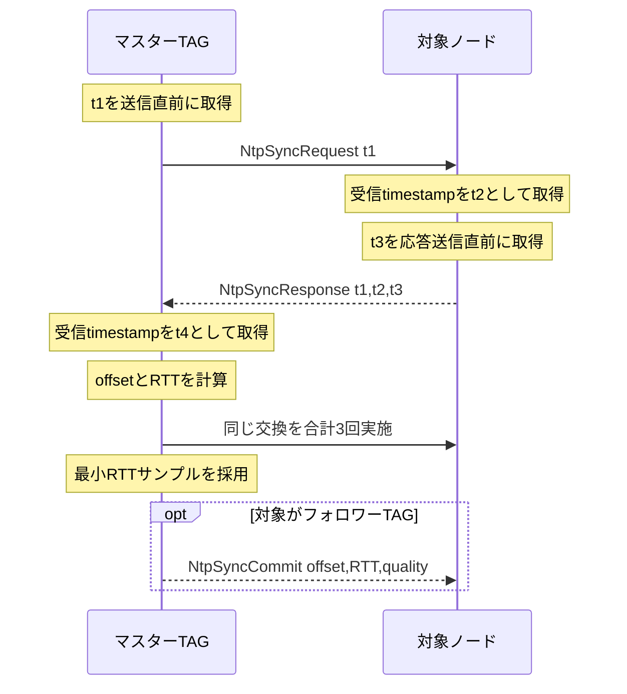
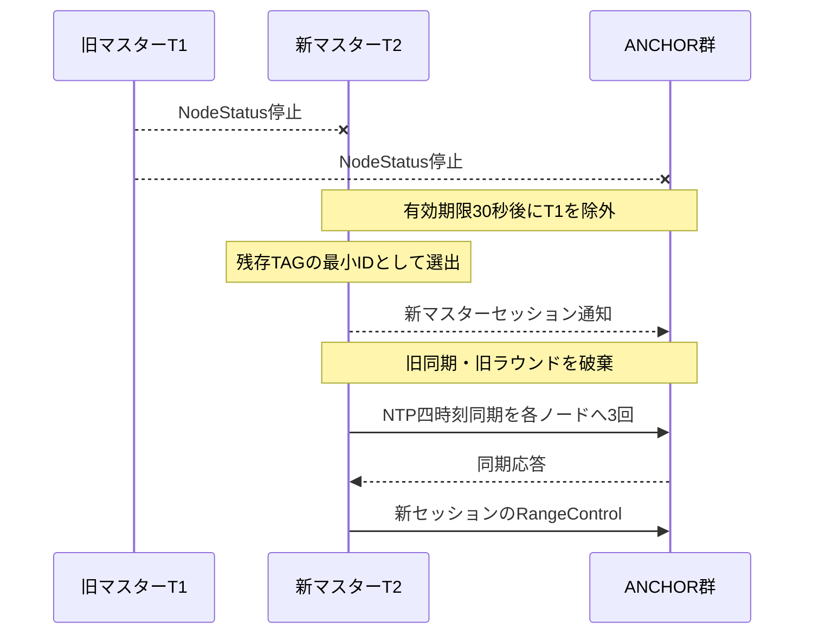

# 複数TAG順次測距・マスターTAG基準時刻同期設計

## 1. 目的

複数のANCHORが複数のTAGを順次測距する。
有効なTAGのうちノードIDが最も小さいTAGをマスターTAGとし、マスターTAGが測距ラウンドと共通時刻を管理する。
各ANCHORはTAGをノードID昇順で測距し、ANCHORもノードID昇順で処理する。
各測距結果は全組み合わせの完了を待たず、1件の測距が完了するたびにマスターTAGへ逐次送信する。
マスターTAGは受信した1件を直ちにアプリケーションへ公開し、対象がフォロワーTAGならそのTAGにも逐次転送する。
マスターTAGは最終ANCHORと最終TAGの結果を受信した直後に次の測距ラウンドを開始し、正常系に固定待機時間を設けない。

各測距結果には、どのANCHORがどのTAGをマスターTAG基準のどの時刻に測距したかを復元できる情報を含める。
マスターTAGと各ANCHORおよびフォロワーTAGの時計差はNTPの四時刻方式で求める。
マスターTAGが変わった場合は以前の同期情報を破棄し、新しいマスターTAGを基準として全ノードの時刻同期をやり直す。

本設計では、ANCHORを外側、TAGを内側のループとして次の順番を正常系とする。

```text
マスターTAG
  -> 最小IDのANCHORで最小IDのTAGを測距
  -> 同じANCHORで次のIDのTAGを測距
  -> ...
  -> 次のIDのANCHORで最小IDのTAGを測距
  -> ...
  -> 最大IDのANCHORで最大IDのTAGを測距
  -> マスターTAG
```

例としてANCHOR 3台、TAG 2台の場合は次の順番になる。

```text
A1-T1 -> A1-T2 -> A2-T1 -> A2-T2 -> A3-T1 -> A3-T2 -> A1-T1 ...
```

提示された`0ms`、`50ms`、`100ms`は順序を示す例として扱う。
50msの固定スロットは設けず、各UWB測距と必要なESP-NOW転送が完了した直後に次の組み合わせへ進む。
全ANCHORと全TAGの組み合わせが完了するまで表示やEKF入力を保留しない。
EKFは各測距結果を独立した非同期観測として、その結果が届いた時点で利用できる。

## 2. 対象範囲

本設計の対象は次のとおりとする。

- ESP-NOWによるノード検出、時刻同期、測距命令、測距結果転送
- RYUW122による各ANCHORからTAGへのUWB測距
- 最小IDのTAGをマスターとする自動選出
- マスターTAGを基準としたANCHORおよびフォロワーTAG時計の補正
- 各ANCHORと各TAGの組み合わせごとの測距開始時刻、完了時刻、所要時間の記録
- NVSによるWi-Fi省電力設定
- 最大8台のANCHORと最大8台のTAGによる順次測距
- 正常系の固定待機時間を持たない状態機械
- 基本的なタイムアウト、古いラウンド破棄、マスターTAG変更の処理

次の処理は本設計の対象外とする。

- EKFによる自己位置推定
- ANCHOR座標を使用した三辺測量
- インターネット上のNTPサーバーとの同期
- ESP-NOW暗号鍵の配布
- 実行中のノードIDや動作モード変更

## 3. 用語

| 用語 | 意味 |
| --- | --- |
| マスターTAG | 有効なTAGのうち最小ノードIDであり、時刻基準、測距ラウンド、逐次結果集約を所有するノード |
| フォロワーTAG | マスターTAG以外のTAG。UWB測距対象となり、自ノード向け逐次結果をマスターTAGから受信する |
| TAG | マスターTAGとフォロワーTAGの総称 |
| ANCHOR | TAGへのUWB測距を行い、結果を次のANCHORまたはTAGへ転送するノード |
| マスターセッション | マスターTAGのMACアドレスと起動時に生成するランダムなセッションIDの組み合わせ |
| 同期サンプル | NTP四時刻の1回分の交換結果 |
| 測距観測 | 1台のANCHORが1台のTAGへ行う1回のUWB測距と、その逐次結果 |
| 測距ラウンド | マスターTAGが最小IDのANCHORへ命令してから全組み合わせを1回ずつ測距するまでの制御単位 |
| 測距経路 | 測距ラウンド開始時に固定するANCHOR一覧とTAG一覧。どちらもノードID昇順 |
| マスターTAG基準時刻 | マスターTAGの単調増加マイクロ秒時刻を64bitへ拡張した時刻 |

## 4. 基本方針

ESP-NOWの受信処理はプロジェクト側の`EspNowTransport`へ集約する。
外部ライブラリの生成物である`.pio/libdeps`は編集しない。

`EspNowTransport`はESP-IDFの`esp_now_recv_info_t`を直接受け取り、受信コールバック内では固定長データのコピーとキュー投入だけを行う。
時刻同期、UWB測距、パケット解析、画面描画は受信コールバック内で行わない。

ノード状態のブロードキャストと順次測距は同じESP-NOWインスタンスを共有する。
ESP-NOWの受信コールバックを複数のクラスが個別登録してはならない。

ノードIDは、動作モードにかかわらず参加する全ノードで一意であることを前提とする。
同一ノードIDを複数MACアドレスが通知する構成の自動解決は実装対象外とし、検出した場合は設定異常として両方を測距経路から除外する。

## 5. クラス構成

### 5.1 EspNowTransport

ESP-NOWとWi-Fiの初期化および送受信を所有する。

責務は次のとおりとする。

- Wi-Fi Stationモードの開始
- NVS設定に基づくWi-Fi省電力設定
- ESP-NOWチャンネル設定
- ESP-NOW初期化と終了
- ブロードキャストpeerとユニキャストpeerの管理
- 250バイト以内のパケット送信
- `esp_now_recv_info_t`から受信情報を固定長構造体へコピー
- 受信キューと送信完了キューの管理
- パケット種別による上位クラスへの配送

ESP-NOW送信は全宛先を通じて1件だけin-flightにし、送信完了コールバックを受け取ってから次の`esp_now_send()`を呼ぶ。
送信要求は単純な固定長FIFOへ入れる。

次ANCHORへ移る場面では、呼び出し側が`RangeControl`を測距結果通知より先にFIFOへ入れる。
複数段階の優先度制御、packet置換、輻輳制御は初期実装へ入れない。
FIFOが満杯の場合は送信要求を失敗として呼び出し側へ返し、診断件数だけを記録する。

NTP同期中は測距ラウンドを開始しないため、NTP通信と測距制御が競合する正常経路はない。

受信情報として最低限次をコピーする。

```cpp
struct EspNowReceivedPacket
{
    uint8_t sourceMac[6];
    uint8_t destinationMac[6];
    int8_t rssi;
    uint8_t channel;
    uint32_t receivedTimestampUs;
    uint16_t payloadLength;
    uint8_t payload[250];
};
```

`esp_now_recv_info_t`、`src_addr`、`des_addr`、`rx_ctrl`は受信コールバック内だけ有効である。
ポインターをキューやメンバー変数へ保存してはならない。

### 5.2 EspNowBroadcast

既存のノード状態ブロードキャストを担当する。
ESP-NOW本体は所有せず、`EspNowTransport`を参照する。

受信した`NodeStatus`は、送信元MACアドレスをキーとして既存の`m_nodes`へ保存する。
別途、各MACアドレスの最終受信時刻を保持する。

`NodeStatus`のwire形式はversionを更新し、最低限次の情報を通知する。

- ノードID
- 動作モード
- 送信元から取得するWi-Fi MACアドレス
- RYUW122の8文字UWBアドレス
- ANCHOR座標
- マスターTAGの場合はマスター宣言とセッションID

起動直後とマスター変更時はNodeStatusを直ちに送信する。
安定動作中は1秒間隔とし、測距制御より低い送信優先度で処理する。

測距経路へ採用するANCHORとTAGは次の条件をすべて満たすものとする。

- 動作モードがANCHORまたはTAG
- 最終状態受信から30秒以内
- MACアドレスが有効

ノードIDは全ノードで一意であることを設定条件とする。
防御的に重複を検出した場合は設定異常として該当ノードをすべて測距経路から除外するが、重複状態からの自動復旧や優先選択は行わない。

有効なTAG一覧をノードID昇順に並べ、先頭をマスターTAGとする。
現在のマスターTAGより小さいIDのTAGを検出した場合、全ノードが新しいマスターTAGへ移行できるようマスター変更イベントを通知する。

### 5.3 TagMasterCoordinator

複数TAGからマスターTAGを選出し、マスターセッションを管理する。

責務は次のとおりとする。

- 有効なTAGをノードID昇順へ整列
- 最小IDのTAGをマスターTAGとして選出
- 自ノードがマスターかフォロワーかの判定
- マスター起動時のランダムなセッションID生成
- マスターTAG変更の検出
- 旧マスターセッションの測距および同期状態の無効化
- マスターTAGのMACアドレス、ノードID、セッションIDの提供
- 受信済みNodeStatusに基づく小さいTAG IDへの切替

全ノードは同じ選出規則を使用する。
起動直後は500msの選出待ち時間を設けてNodeStatusを収集する。
これは測距間隔の固定待機ではなく、マスター選出時だけの待機である。

より小さいIDのTAGを後から検出した場合、旧マスターは新しいラウンドの開始を停止する。
ANCHORは進行中のUWB処理を安全に終了または排出するが、旧セッションの次ノード転送は行わない。
新マスターは全対象ノードとの時刻同期を完了してから新しいラウンドを開始する。

### 5.4 NtpTimeSynchronizer

マスターTAGと各ANCHORおよび各フォロワーTAG間のNTP四時刻同期を管理する。

責務は次のとおりとする。

- マスターセッションの識別
- 同期要求と同期応答の処理
- 各非マスターノードにつき3回の同期サンプル取得
- 最小往復遅延サンプルの採用
- 各ノード時計とマスターTAG時計の差の保持
- 32bit受信時刻の折り返しを考慮した差分計算
- 各ノード時刻からマスターTAG基準時刻への変換
- 同期時RSSI、受信チャンネル、同期経過時間の提供
- マスターTAG変更時の同期情報破棄
- フォロワーTAGへの同期結果通知

マスターTAG以外のノードは最終的な時計差を決定しない。
マスターTAGが全ノードの時計差を保持し、測距結果を受信するたびにANCHOR時刻をマスターTAG基準へ変換する。
フォロワーTAGには採用した時計差、往復遅延、同期品質を通知し、フォロワー側のセンサー時刻も同じ基準へ変換できるようにする。

### 5.5 Ryuw122Controller

既存のRYUW122初期化に加え、非同期測距を提供する。

責務は次のとおりとする。

- G7をM5StickS3のUART送信として使用
- G1をM5StickS3のUART受信として使用
- UARTを115200bpsで開始
- TAGまたはANCHORモードの設定
- UWBネットワークIDと8文字アドレスの設定
- ANCHORから指定TAGへの非同期測距開始
- RYUW122受信処理の更新
- 測距完了、RSSI、距離の通知
- 300msの測距タイムアウト管理
- タイムアウト後の遅延応答を次ラウンドへ誤帰属させない処理

正常系の測距開始前後に固定`delay()`を追加しない。

### 5.6 SequentialRangingController

TAG側とANCHOR側の順次測距状態機械を担当する。

責務は次のとおりとする。

- ANCHOR ID昇順、TAG ID昇順の二重測距経路作成
- 測距ラウンドIDの生成
- 最小IDのANCHORへの測距命令送信
- 自ノードと対象TAGが現在の測距位置に一致することの検証
- 各ANCHORでTAG ID昇順にRYUW122測距を開始
- 1件の測距完了直後に逐次結果をマスターTAGへ送信
- 同じANCHORの次TAG測距の即時開始
- 最終TAG完了後の次ANCHORへの制御移譲
- 重複パケットの再測距防止
- UWB失敗時も次の組み合わせへ進む処理
- マスターTAGでの逐次結果確定と即時公開
- フォロワーTAGへの対象結果の逐次転送
- 最終組み合わせ確定直後の次ラウンド開始
- 逐次結果をアプリケーションへ引き渡すAPI

`main.cpp`は`Begin()`、`Update()`、逐次結果取得だけを呼び出す。
順序制御、時刻同期計算、パケット構築を`main.cpp`へ記述してはならない。

実装ファイルは次のように分離し、基本ファイル名を主要クラス名へ合わせる。

| ヘッダー | 実装 | 主責務 |
| --- | --- | --- |
| `include/EspNowTransport.h` | `src/EspNowTransport.cpp` | raw ESP-NOW、受信情報コピー、固定長FIFO送信 |
| `include/EspNowBroadcast.h` | `src/EspNowBroadcast.cpp` | NodeStatusと`m_nodes` |
| `include/TagMasterCoordinator.h` | `src/TagMasterCoordinator.cpp` | 最小TAG IDによるマスター選出 |
| `include/NtpTimeSynchronizer.h` | `src/NtpTimeSynchronizer.cpp` | NTP四時刻同期と時刻変換 |
| `include/Ryuw122Controller.h` | `src/Ryuw122Controller.cpp` | RYUW122初期化と非同期UWB測距 |
| `include/SequentialRangingController.h` | `src/SequentialRangingController.cpp` | 二重ループ測距と逐次結果公開 |
| `include/SequentialRangingProtocol.h` | `src/SequentialRangingProtocol.cpp` | wire packetのencode、decode、検証 |

## 6. ESP-NOW受信情報

ESP-IDF 5系の受信コールバックを次の形式で登録する。

```cpp
void OnReceive(
    const esp_now_recv_info_t* info,
    const uint8_t* data,
    int dataLength);
```

次の値を使用する。

| フィールド | 使用目的 |
| --- | --- |
| `info->src_addr` | 送信元の検証とノード特定 |
| `info->des_addr` | ブロードキャストとユニキャストの識別 |
| `info->rx_ctrl->timestamp` | NTPの`t2`または`t4`と測距命令受信時刻 |
| `info->rx_ctrl->rssi` | ESP-NOWリンク品質記録 |
| `info->rx_ctrl->channel` | NVS設定チャンネルとの一致確認 |

`rx_ctrl`がnullの場合は、コールバック冒頭の`esp_timer_get_time()`下位32bitを受信時刻として使用し、時刻品質を低下状態として記録する。

ESP-IDFの`wifi_pkt_rx_ctrl_t::timestamp`は32bitマイクロ秒であり、約71分で折り返す。
差分は符号付き32bitのmodulo演算で求める。
TAGへ公開する時刻は、現在のTAG時刻または測距ラウンド開始時刻に最も近い64bit時刻へ拡張する。

初回実機検証では、同じ受信コールバック内で取得した`rx_ctrl->timestamp`と`esp_timer_get_time()`下位32bitの差を記録し、同一のローカル時刻として安定して扱えることを確認する。
差が不連続になる場合は`rx_ctrl->timestamp`を独立した32bit時計として扱い、時刻品質を低下状態にする。

## 7. Wi-Fi省電力設定

NVSへ次の設定を追加する。

| キー | 型 | 既定値 | 意味 |
| --- | --- | --- | --- |
| `wifi_power_save` | `bool` | `false` | Wi-Fi Modem Sleepを使用するか |

キー長はESP32 NVSの15文字制限以内とする。

設定値と処理の対応は次のとおりとする。

| NVS値 | ESP-IDF設定 | 動作 |
| --- | --- | --- |
| `false` | `esp_wifi_set_ps(WIFI_PS_NONE)` | 最小遅延と高精度な受信時刻を優先 |
| `true` | `esp_wifi_set_ps(WIFI_PS_MIN_MODEM)` | 消費電力を優先し、時刻品質を低下扱いにする |

設定はWi-Fi初期化後、ESP-NOW通信開始前に適用する。
設定適用に失敗した場合、`EspNowTransport::Begin()`は失敗を返す。

NT-Shellでは既存のPreferencesコマンドを使用する。

```text
pref get bool wifi_power_save
pref set bool wifi_power_save false
pref set bool wifi_power_save true
```

変更は次回起動時に反映する。
既定値は`false`であり、設定が存在しない場合は型情報付きでNVSへ保存する。

`true`は`WIFI_PS_MIN_MODEM`だけを設定する。
ESP-NOW専用wake windowとwake intervalの設定は本設計の対象外とする。

## 8. NTP四時刻同期

### 8.1 四時刻

マスターTAGと各非マスターノードとの同期で次の時刻を取得する。

| 時刻 | 時計 | 取得位置 |
| --- | --- | --- |
| `t1` | マスターTAG | 同期要求の`esp_now_send()`直前 |
| `t2` | 対象ノード | 同期要求受信時の`rx_ctrl->timestamp` |
| `t3` | 対象ノード | 同期応答の`esp_now_send()`直前 |
| `t4` | マスターTAG | 同期応答受信時の`rx_ctrl->timestamp` |

対象ノード時計からマスターTAG時計へのオフセットを次の式で求める。

```text
nodeMinusMasterUs = ((t2 - t1) + (t3 - t4)) / 2
```

往復遅延を次の式で求める。

```text
roundTripUs = (t4 - t1) - (t3 - t2)
```

対象ノード時刻をマスターTAG基準へ変換する式は次のとおりとする。

```text
masterTimeUs = nodeTimeUs - nodeMinusMasterUs
```

計算途中は符号付き64bitへ拡張し、32bit折り返しを考慮する。

### 8.2 サンプル選択

各非マスターノードにつき3サンプルを順次取得する。
3サンプルのうち、値が妥当で往復遅延が最小のサンプルを採用する。

NTP同期中は同一ノードから複数のESP-NOW送信を同時に保留しない。
直前送信の送信完了コールバックを受け取ってから次の同期サンプルを送る。
`t1`と`t3`は無線ハードウェアの実送信時刻ではなく`esp_now_send()`直前のソフトウェア時刻であるため、送信待ち時間はNTP誤差要因になる。
1送信だけを保留し、最小往復遅延サンプルを採用することで、この誤差を抑える。

次の場合は同期サンプルを無効とする。

- セッションIDが一致しない
- 要求シーケンスが一致しない
- 送信元MACと対象ノードが一致しない
- 受信チャンネルが設定値と一致しない
- 往復遅延が負値または同期タイムアウトを超える
- 同じ応答を重複受信した

1サンプル以上成功した場合は最小往復遅延サンプルを採用する。
全サンプルが失敗したANCHORは、そのマスターセッションの測距経路へ含めない。
全サンプルが失敗したフォロワーTAGも、そのマスターセッションの測距経路へ含めない。

### 8.3 マスターTAG変更

マスターセッションは次の組み合わせで識別する。

```text
マスターTAGのノードID + Wi-Fi MACアドレス + 起動時ランダムセッションID
```

全ノードは`TagMasterCoordinator`が選出した最小IDのTAGから届いた同期要求だけを受け付ける。
異なるマスターセッションへ切り替える場合、以前のセッションに関する時計差、ラウンドID、重複排除情報、保留中転送を破棄する。

ANCHORがUWB測距中により小さいIDの新マスターを認識した場合、RYUW122の応答を完了またはタイムアウトまで排出する。
旧セッションの結果や次ノード命令は送らず、その後に新マスターセッションへ切り替える。

フォロワーTAGは自ノードより小さいIDの有効なTAGが存在する間、測距ラウンドを開始しない。
マスターTAGが30秒間検出できなくなった場合、残ったTAGのうち最小IDを新マスターとして選出し、全ノードの同期を最初からやり直す。

## 9. マスター選出と測距経路

### 9.1 マスターTAG選出

各ノードは有効なTAGをノードID昇順へ並べ、先頭をマスターTAGと判断する。
ノードIDは全ノードで一意であることを前提とする。

選出例を次に示す。

```text
TAG ID: 5, 1, 9
マスターTAG: 1
フォロワーTAG: 5, 9
```

マスターTAGだけが測距ラウンドを開始する。
NodeStatusと各プロトコルパケットにはマスターTAG ID、マスターMAC、セッションIDを含める。
受信側は、自身が認識している最小TAG IDと一致しないマスターからの新規ラウンドを拒否する。

### 9.2 二重測距経路

マスターTAGは測距ラウンド開始直前に、有効かつ同期済みのANCHORとTAGをそれぞれノードID昇順へ並べる。
両方の一覧はラウンド終了まで変更しない。

最大ANCHOR数と最大TAG数はそれぞれ8台とする。
上限を超えた場合はノードIDが小さい8台を使用し、切り捨て状態をラウンド状態へ記録する。

例を次に示す。

```text
ANCHOR ID: 7, 0, 2
TAG ID: 5, 1
測距順: A0-T1, A0-T5, A2-T1, A2-T5, A7-T1, A7-T5
```

現在位置は`anchorIndex`と`tagIndex`で表す。
1件の測距が完了したら、同じANCHOR内で`tagIndex`を進める。
そのANCHORの最終TAGが完了したら`tagIndex`を0へ戻し、`anchorIndex`を進めて次ANCHORへ制御を渡す。

ラウンド開始後に新しいANCHORまたはTAGを検出しても現在ラウンドへ追加しない。
次ラウンド開始前に候補として評価し、時刻同期がなければ同期を完了してから経路へ加える。

### 9.3 最短周期と逐次公開

測距開始時刻を50ms間隔などの固定スロットへ合わせない。
RYUW122が1件の測距を完了またはタイムアウトした時点で、その結果を送信キューへ入れ、次の組み合わせを直ちに開始する。

同じANCHORの次TAGを測距する場合、ESP-NOWの結果送信完了を待たず、RYUW122が次測距を受け付けられる時点で開始する。
次ANCHORへ移る場合は、次ANCHORへの制御パケットを結果通知より高い優先度で送る。
これによりESP-NOW結果通知と次のUWB測距を可能な限り並行させる。

マスターTAGは各観測を受信するたびに`TryTakeMeasurement()`から1件ずつ公開する。
全組み合わせの完了を待つ`TryTakeCompletedRound()`だけに依存する設計にはしない。
ラウンド完了通知は経路管理、欠損検出、統計のために別途公開する。

提示例で各測距が仮に50msかかる場合、T1の逐次観測は0ms、100ms、200ms、300msに届き、T2の逐次観測は50ms、150ms、250ms、350msに届く。
各TAGは100msごとに異なるANCHORの観測を受け取れるため、3台分が揃う300msを待たずにEKFを更新できる。
実際の間隔はRYUW122の測距完了時間に従い、50msへ丸めたり待ち合わせたりしない。

## 10. パケット形式

すべてのプロトコル構造体は明示的な整数幅と1バイトpackingを使用する。
enumの生サイズには依存せず、wire上では`uint8_t`へ変換する。
エンコードとデコードではパケット長、magic、version、種別、セッションIDを検査する。

### 10.1 共通ヘッダー

```cpp
struct RangePacketHeader
{
    uint16_t magic;
    uint8_t version;
    uint8_t packetType;
    uint32_t sessionId;
    uint32_t sequence;
};
```

### 10.2 パケット種別

```text
NodeStatus
NtpSyncRequest
NtpSyncResponse
NtpSyncCommit
RangeControl
RangeMeasurement
RangeMeasurementForward
RangeRoundComplete
```

### 10.3 同期要求

同期要求には次を含める。

- 共通ヘッダー
- マスターTAG IDとMACアドレス
- 対象ノードID
- `t1`

### 10.4 同期応答

同期応答には次を含める。

- 共通ヘッダー
- 対象ノードID
- 要求から受け取った`t1`
- 受信時刻`t2`
- 応答送信時刻`t3`

### 10.5 同期確定通知

フォロワーTAGへ送る同期確定通知には次を含める。

- 共通ヘッダー
- 対象TAG ID
- 採用した`nodeMinusMasterUs`
- 同期往復遅延
- 同期品質
- 同期確定時のマスターTAG時刻

### 10.6 測距制御

測距制御パケットには次を含める。

- 共通ヘッダー
- ラウンドID
- マスターTAG IDとMACアドレス
- ANCHOR数
- TAG数
- 現在の`anchorIndex`
- 最大8件のANCHOR ID一覧
- 最大8件のTAG ID一覧

各ノードのMACアドレスとTAGのUWBアドレスは`EspNowBroadcast`のNodeStatus表から解決する。
ラウンド開始時のID一覧と現在のNodeStatus表が一致しない場合、その組み合わせを到達不能としてマスターTAGへ通知する。

### 10.7 逐次測距結果

wire上の1件の測距結果は次の情報を持つ。

```cpp
struct RangeMeasurementWireResult
{
    uint8_t anchorId;
    uint8_t tagId;
    uint8_t status;
    uint32_t distanceMm;
    int16_t uwbRssi;
    uint32_t commandReceivedUs;
    uint32_t rangingStartedUs;
    uint32_t rangingCompletedUs;
    int8_t espNowRssi;
};
```

`RangeMeasurement`は1件の結果だけをマスターTAGへ送る。
`RangeMeasurementForward`はマスターTAG基準へ変換した同じ1件を対象フォロワーTAGへ送る。
全結果を1パケットへ蓄積しないため、ANCHOR数とTAG数が増えてもESP-NOW v1の250バイト上限を超えない。

初期実装ではESP-NOWの送信完了コールバックだけを使用し、アプリケーション層のACKと再送キューは設けない。
送信失敗またはpacket lossはラウンドの欠損として検出し、次ラウンドで新しい観測を取得する。

### 10.8 ラウンド完了

最終ANCHORの最終TAG測距結果には最終組み合わせフラグを付ける。
マスターTAGは最終フラグと受信済み組み合わせbitsetを確認し、全件受信またはラウンドタイムアウトで`RangeRoundComplete`を確定する。
マスターTAGは次ラウンドの`RangeControl`を先に送信要求した後、ラウンドID、期待件数、受信件数、欠損bitsetを含む`RangeRoundComplete`を各フォロワーTAGへ通知する。

各wire構造体に`static_assert(sizeof(...) <= 250)`を置く。
パケットは一括結果ではなく1件単位のため、ESP-NOW v2専用の1470バイトペイロードには依存しない。

## 11. 測距結果

マスターTAGが公開する結果はwire構造体をそのまま公開せず、マスターTAG基準の64bit時刻へ変換する。

```cpp
struct TimedRangeMeasurement
{
    uint32_t sessionId;
    uint32_t roundId;
    uint8_t anchorId;
    uint8_t tagId;
    EnRangeResultStatus status;
    uint32_t distanceMm;
    int16_t uwbRssi;
    int8_t espNowRssi;
    uint64_t commandReceivedMasterTimeUs;
    uint64_t rangingStartedMasterTimeUs;
    uint64_t rangingCompletedMasterTimeUs;
    uint32_t rangingDurationUs;
    uint32_t synchronizationRoundTripUs;
    uint64_t synchronizationAgeUs;
    EnTimeQuality timeQuality;
    bool isLastMeasurement;
};
```

`rangingDurationUs`は同一ANCHOR時計内の次の差分であり、時計オフセットの影響を受けない。

```text
rangingCompletedUs - rangingStartedUs
```

前の測距完了時刻と次の測距命令受信時刻の差から、ローカル切替またはESP-NOW転送に要した時間を求められる。

`TryTakeMeasurement()`は受信済み観測を固定長FIFOから1件ずつ返す。
アプリケーションはラウンド完了を待たずに画面表示とEKF入力を更新できる。
FIFOが満杯の場合は最古結果を黙って上書きせず、overflow件数を記録してラウンド品質を低下状態にする。

ラウンド完了情報は次の構造で別に公開する。

```cpp
struct SequentialRangeRoundSummary
{
    uint32_t sessionId;
    uint32_t roundId;
    uint64_t startedMasterTimeUs;
    uint64_t completedMasterTimeUs;
    uint32_t totalDurationUs;
    uint8_t anchorCount;
    uint8_t tagCount;
    uint8_t expectedMeasurementCount;
    uint8_t receivedMeasurementCount;
    bool anchorListTruncated;
    bool tagListTruncated;
    bool timedOut;
};
```

`TryTakeCompletedRound()`は統計と欠損検出用であり、逐次結果公開を妨げない。

## 12. TAG側状態機械

TAG側の状態は次のとおりとする。

```text
ElectingMaster
FollowingMaster
WaitingForNodes
Synchronizing
ReadyToStart
RunningRound
```

### 12.1 ElectingMaster

起動後にNodeStatusを収集し、有効なTAGの最小IDを選出する。
自ノードが最小IDならマスターセッションを開始し、そうでなければ`FollowingMaster`へ移る。

### 12.2 FollowingMaster

フォロワーTAGとしてマスターの同期要求に応答し、自ノード向けの逐次結果を受信する。
受信した結果は直ちに`TryTakeMeasurement()`から公開する。

より小さいIDのTAGが消失し、自ノードが新しい最小IDになった場合は`ElectingMaster`を経て新マスターになる。

### 12.3 WaitingForNodes

マスターTAGとして有効なANCHORとTAGを収集する。
ANCHORが1台以上あり、TAG一覧が確定したら未同期ノードの同期を開始する。

### 12.4 Synchronizing

ノードID昇順で各ANCHORと各フォロワーTAGのNTP同期を行う。
同期済みANCHORが1台以上あり、対象TAGが同期済みになれば`ReadyToStart`へ移る。

### 12.5 ReadyToStart

同期済みで有効なANCHOR一覧とTAG一覧から二重経路を作成する。
ラウンドIDを更新し、最小IDのANCHORへ測距チェーンパケットを送る。
送信成功後は`RunningRound`へ移る。

### 12.6 RunningRound

各ANCHORから1件ずつ届く逐次結果を受信する。
送信元MAC、セッションID、ラウンドID、ANCHOR ID、TAG ID、現在の経路範囲を検証する。

正しい結果を受信するたびにANCHORのローカル時刻をマスターTAG時刻へ変換し、固定長FIFOへ公開する。
対象がフォロワーTAGなら、変換済み結果をそのTAGへ逐次転送する。

最終組み合わせの結果と全結果bitsetを確認したらラウンド完了を確定する。
同じ`Update()`内で次ラウンド制御を最小IDのANCHORへ先に送信要求し、その後に画面描画や結果転送を処理する。

ラウンドタイムアウト時は未受信の組み合わせを欠損としてラウンド完了情報へ記録し、古いラウンドを無効化して次ラウンドへ進む。

## 13. ANCHOR側状態機械

ANCHOR側の状態は次のとおりとする。

```text
Idle
Ranging
Forwarding
WaitingForLateResponseDrain
```

### 13.1 Idle

同期要求または自ノードが現在`anchorIndex`となっている測距制御を待つ。

測距チェーン受信時に次を検証する。

- 現在のマスターセッションと一致する
- 送信元がマスターTAGまたは経路上の直前ANCHORである
- 自ノードIDが現在`anchorIndex`のANCHOR IDと一致する
- 同じラウンドとTAG indexをすでに測距していない
- パケット長、ANCHOR一覧、TAG一覧が妥当

検証後、命令受信時刻を保存し、最小IDのTAGから直ちにRYUW122測距を開始する。

### 13.2 Ranging

RYUW122の非同期応答を待つ。
応答受信時に測距完了時刻、距離、UWB RSSIを保存する。

300ms以内に応答がない場合はUWBタイムアウト結果を生成する。
結果は1件単位でマスターTAGへの送信キューへ追加する。

同じANCHORに次のTAGがある場合、結果送信完了を待たず、RYUW122が受け付け可能になり次第そのTAGの測距を開始する。
UWB失敗でも次の組み合わせへ進む。

### 13.3 Forwarding

自ANCHORの最終TAGが完了し、次の`anchorIndex`が存在する場合は、次ANCHORへの測距制御を結果通知より先に送信要求する。
自ノードが最後のANCHORの場合、最終測距結果へ最終組み合わせフラグを付けてマスターTAGへ送る。

次ANCHORへの制御送信要求をキューへ投入した後、固定待機をせず`Idle`へ戻る。
次ANCHORのMACアドレスが見つからない場合、または制御送信が失敗した場合は、残りの組み合わせが到達不能であることをマスターTAGへ1回通知する。
マスターTAGへの通知も失敗した場合は、マスター側ラウンドタイムアウトによる回復に任せる。

### 13.4 WaitingForLateResponseDrain

UWBタイムアウト後に到着した古い応答を次ラウンドへ誤帰属させないための失敗時専用状態とする。
正常系ではこの状態へ入らない。

遅延応答を破棄するか、規定の排出期限が経過した後に`Idle`へ戻る。
失敗時専用の待機は正常系の最短周期へ影響させない。

## 14. シーケンス図

### 14.1 複数TAGの正常系

次の図はT1が最小IDのマスターTAG、T2がフォロワーTAG、A1とA2がANCHORの場合を示す。
各測距結果は1件ずつマスターTAGへ届き、全組み合わせの完了を待たずに公開される。



図中の並行区間は、ESP-NOWの逐次結果通知を待たずに別無線であるRYUW122の次測距を開始する意図を示す。
実装は単一スレッドの`Update()`状態機械でもよく、ブロッキング待機を置かず双方を進行させる。

### 14.2 NTP四時刻同期

マスターTAGは各ANCHORと各フォロワーTAGへ同じ手順を実行する。



### 14.3 マスターTAG交代



より小さいIDのTAGが後から参加した場合も同じ交代処理を行うが、30秒の消失待ちは行わず、NodeStatus受信後に旧マスターが新規ラウンド開始を停止する。

## 15. 重複と古いデータ

識別には次を使用する。

```text
masterTagId + master MAC + sessionId + roundId + anchorIndex + tagIndex
```

同一ANCHORが同じラウンドと同じTAG indexを重複受信した場合、UWB測距を再実行せず破棄する。

マスターTAGまたはフォロワーTAGが同じ測距結果を重複受信した場合、アプリケーションへ再公開せず破棄する。
初期実装では重複packetに対する再送応答を行わない。

現在より古いラウンドは破棄する。
現在より新しいラウンドを受信した場合、古い保留状態を破棄して新しいラウンドへ移る。

マスターセッションが異なる測距命令は、新マスターとのNTP同期が完了するまで受け付けない。

## 16. タイムアウト

初期値は次のとおりとする。

| 項目 | 初期値 |
| --- | --- |
| NTP応答待ち | 100ms |
| NTPサンプル数 | 3回 |
| UWB測距待ち | 300ms |
| ESP-NOW送信完了待ち | 50ms |
| NodeStatus有効期間 | 30秒 |
| 初回マスター選出待ち | 500ms |

マスターTAGのラウンドタイムアウトはANCHOR数とTAG数から計算する。

```text
roundTimeoutMs
= anchorCount * tagCount * uwbTimeoutMs
 + anchorCount * espNowHopBudgetMs
 + finalReturnBudgetMs
```

固定値としてラウンド周期を制限しない。
正常に最終組み合わせの結果を受信した場合、ラウンドタイムアウトを待たず次ラウンドを開始する。
フォロワー転送はラウンドタイムアウトの待機理由にしない。

## 17. 時刻品質

時刻品質を次の状態で公開する。

```text
Synchronized
PowerSaveEnabled
ReceiveTimestampUnavailable
SynchronizationExpired
Unsynchronized
```

Wi-Fi省電力が有効な場合、NTP計算自体が成功しても`PowerSaveEnabled`とする。
`rx_ctrl->timestamp`が取得できない場合は`ReceiveTimestampUnavailable`とする。

初期実装ではマスターTAG変更時だけ必須再同期を行う。
同期からの経過時間はすべての逐次結果へ含める。
長時間運転時の周期的再同期は、実機で時計ドリフトを測定した後に追加判断する。

## 18. main.cppとの境界

`main.cpp`が行う処理を次に限定する。

- NVSと`ConfigRuntime`の初期化
- `EspNowTransport`の生成と開始
- `EspNowBroadcast`の生成と更新
- `TagMasterCoordinator`の生成と更新
- `Ryuw122Controller`の生成と開始
- `NtpTimeSynchronizer`の生成
- `SequentialRangingController`の生成と更新
- 逐次測距結果とラウンド完了情報の取得
- 画面表示

NTP計算、パケット解析、ANCHOR順序決定、UWB測距チェーンを`main.cpp`へ記述しない。

画面描画やNT-Shell処理により、次測距または次ラウンド開始が遅延してはならない。
マスターTAGは逐次結果を内部FIFOへ保存し、必要な次測距制御を送信キューへ入れた後、画面描画を行う。

## 19. コーディング規約

本実装で追加または変更するすべての関数へ、次の形式の日本語Doxygenコメントを付ける。

```cpp
/**
 * @brief 受信した同期応答から時計差を計算します。
 * 往復遅延が最小の同期サンプルを採用します。
 *
 * @param response 受信した同期応答
 * @param receivedTimestampUs TAG側のハードウェア受信時刻
 * @return 同期情報を更新した場合はtrue、それ以外はfalse
 */
```

規則は次のとおりとする。

- `@brief`本文は日本語
- 全引数へ宣言順で`@param`
- 非void関数へ`@return`
- constructor、destructor、削除した特殊メンバー関数もコメント対象
- headerに宣言がある関数はheader宣言へコメントを置く
- cpp内だけに存在する関数、callback、`setup()`、`loop()`はdefinitionへコメントを置く
- enum class名は`En`で始める
- 関数名とクラス名はUpperCamelCase
- メンバー変数は`m_`に続けてlowerCamelCase
- 基本ファイル名は主要クラス名と一致させる
- コールバック内で動的確保、画面出力、Serial出力、UWB処理を行わない

## 20. 検証方針

### 20.1 単体検証

時計と通信を差し替え可能にし、次をホストテストする。

- NTPオフセット計算
- NTP往復遅延計算
- 32bit時刻折り返し
- 3サンプルから最小往復遅延を選択
- ANCHOR ID昇順化
- TAG ID昇順化
- 最小TAG IDのマスター選出
- 全ノードでIDが一意な正常系
- 防御的なノードID重複除外
- 最大ANCHOR 8台、最大TAG 8台制限
- マスターTAG変更時の全同期破棄
- `A1-T1, A1-T2, A2-T1, A2-T2`の二重ループ順序
- 古いラウンドと重複ラウンドの処理
- 1件完了ごとの逐次結果公開
- 全組み合わせ完了前にアプリケーションが結果取得可能であること
- 結果送信待ちと次UWB測距が独立して進むこと
- UWB失敗後も次のTAGまたは次ANCHORへ進むこと
- 最終組み合わせ受信直後の次ラウンド開始
- 重複結果を二重公開しないこと
- フォロワーTAGへの逐次転送
- 最大パケットサイズが250バイト以内
- Wi-Fi省電力設定の既定値がOFF

### 20.2 ビルド検証

M5StickS3環境でclean buildを行う。
次のソースが実際にcompileされることを確認する。

- `EspNowTransport.cpp`
- `EspNowBroadcast.cpp`
- `TagMasterCoordinator.cpp`
- `NtpTimeSynchronizer.cpp`
- `SequentialRangingController.cpp`
- `Ryuw122Controller.cpp`
- `ConfigPreference.cpp`
- `ConfigRuntime.cpp`
- `main.cpp`

### 20.3 実機検証

複数TAG確認の最低構成はTAG 2台とANCHOR 3台とする。

確認項目は次のとおりとする。

- 全ノードのIDが一意な構成で最小TAG IDがマスターになる
- `A1-T1, A1-T2, A2-T1, A2-T2, A3-T1, A3-T2`の順で測距される
- 50msなどの固定スロットを待たず、各測距完了後に次測距が開始する
- 各測距結果が全組み合わせ完了前にマスターTAGへ逐次表示される
- フォロワーTAGが自ノード向け結果を逐次受信する
- 最終組み合わせ受信後に固定待機なく次ラウンドを開始する
- 各ANCHORとTAGの組み合わせについてマスターTAG基準測距時刻を取得できる
- 各測距の所要時間を取得できる
- NTPの往復遅延と時刻差を取得できる
- より小さいIDのTAG参加時にマスターが交代し、時刻同期がやり直される
- マスターTAG停止時に次の最小TAGがマスターとなり、時刻同期がやり直される
- UWBタイムアウトした組み合わせがあっても次の組み合わせへ進む
- Wi-Fi省電力OFFで受信timestampが安定する
- Wi-Fi省電力ONで時刻品質が低下状態として記録される

## 21. 実装順序

実装は次の順序で行う。

1. NVSへ`wifi_power_save`を追加する。
2. `EspNowTransport`を追加し、`esp_now_recv_info_t`を保持せず必要情報だけコピーする。
3. `EspNowBroadcast`を共通transport利用へ移行する。
4. `TagMasterCoordinator`を実装し、最小TAG IDの選出とセッション交代を実装する。
5. NTP packetと`NtpTimeSynchronizer`を実装し、ANCHORとフォロワーTAGを同期する。
6. `Ryuw122Controller`へ非同期測距APIを追加する。
7. 逐次測距packetと`SequentialRangingController`を実装する。
8. `main.cpp`へ最小限のcompositionを追加する。
9. ホストテストとM5StickS3 buildを行う。
10. TAG 2台、ANCHOR 3台以上で実機検証する。

コード実装は本設計の確認後に開始する。

## 22. 参考資料

- [ESP-IDF ESP-NOW API](https://docs.espressif.com/projects/esp-idf/en/stable/esp32s3/api-reference/network/esp_now.html)
- [ESP32-S3 Wi-Fi Performance and Power Save](https://docs.espressif.com/projects/esp-idf/en/latest/esp32s3/api-guides/wifi-driver/wifi-performance-and-power-save.html)
- 使用中のRYUW122ライブラリ: `.pio/libdeps/m5stack-sticks3/RYUW122`
